# 🚀 Infrastructure & Deployment

## 🏗️ System Architecture


## 🌐 Services Status

| Service | Domain | Internal Port | Status |
| :--- | :--- | :--- | :--- |
| **Landing Page** | [tranthachnguyen.com](https://tranthachnguyen.com) | `80` | 🟢 Live |
| **LinguaFlow** | [linguaflow.tranthachnguyen.com](https://linguaflow.tranthachnguyen.com) | `3000-3002` | 🟢 Live |
| **NanoEdit AI** | [photoedit.tranthachnguyen.com](https://photoedit.tranthachnguyen.com) | `5173-5174` | 🟢 Live |
| **Passport Photo** | [passportphoto.tranthachnguyen.com](https://passportphoto.tranthachnguyen.com) | `5185` | 🟢 Live |
| **Comic News** | [comicnews.tranthachnguyen.com](https://comicnews.tranthachnguyen.com) | `5187` | 🟢 Live |
| **IL Driver** | [illinoisdriverstudy.tranthachnguyen.com](https://illinoisdriverstudy.tranthachnguyen.com) | `80` | 🟢 Live |
| **DevOps Study** | [devopsstudy.tranthachnguyen.com](https://devopsstudy.tranthachnguyen.com) | `80` | 🟢 Live |
| **DevOps Game** | [devopsgame.tranthachnguyen.com](https://devopsgame.tranthachnguyen.com) | `80` | 🟢 Live |

---

## 🔄 Deployment Pipelines

We support two deployment methods. CI/CD is recommended.

### 1. GitHub Actions (Automated)

```mermaid
sequenceDiagram
    participant Dev as 👨‍💻 Developer
    participant GH as GitHub Repo
    participant Action as ⚙️ CI/CD Runner
    participant Server as 🖥️ Proxmox

    Dev->>GH: Push to main
    GH->>Action: Trigger ci.yml
    Action->>Action: 🔍 Detect Changes
    Action->>Action: 📦 Build Changed Apps
    Action->>Server: 🚀 SSH Deploy (rsync)
    Server->>Server: docker-compose up -d
```



> [!TIP]
> **Manual Deploy:** Go to [Actions Tab](https://github.com/tranthachnguyen/tranthachnguyen-apps/actions) -> Select "Manual Deploy" -> Run Workflow

### 2. Manual Script (Legacy)

Run from your local machine terminal:

```bash
./deploy-to-proxmox.sh
```

---

## 🛠️ Server Management (Cheatsheet)

Run these commands after SSHing into the server:
`ssh root@192.168.0.50`

### Quick Commands

| Action | Command |
| :--- | :--- |
| **View Logs** | `docker-compose logs -f [service]` |
| **Restart App** | `docker-compose restart [service]` |
| **Rebuild App** | `docker-compose up -d --build [service]` |
| **Stop All** | `docker-compose down` |
| **Check Status** | `docker-compose ps` |

### 🔑 Credentials & Config
- **Remote Path:** `/opt/tranthachnguyen`
- **Env File:** `.env` (Requires `GEMINI_API_KEY`)
- **Tunnels:** `infra/cloudflared/config.yml`
